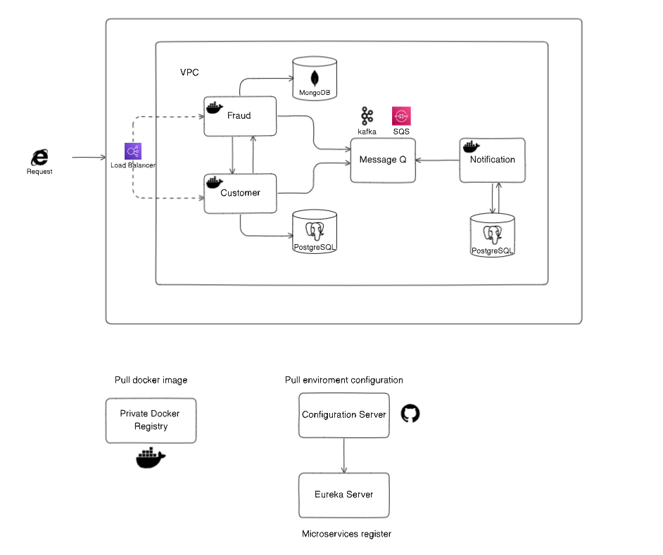

# Simple - Microservices

## Introduction

This is a simple microservices architecture designed to demonstrate the basic principles of building scalable and resilient applications using microservices. Each microservice is containerized using Docker, providing a consistent and isolated environment for running the services.

## Load Balancing

For load balancing, you have the flexibility to choose between the following options:

1. **ELB (Elastic Load Balancer)**: If you are deploying on AWS, you can utilize the Elastic Load Balancer service for distributing incoming traffic across multiple instances of microservices. You can configure ELB to work with the containerized microservices for improved availability and fault tolerance.

2. **Azure Load Balancer**: If you are using Microsoft Azure, you have the option to leverage the Azure Load Balancer for load distribution. It provides similar functionalities to ELB and can be easily integrated into your microservices architecture.

Note: Ensure that the load balancer you choose is compatible with containerized environments and suits your specific cloud provider or infrastructure setup.

## Message Queue

For enabling communication between microservices and achieving decoupling, you can utilize one of the following message queuing systems:

1. **SQS (Simple Queue Service)**: Amazon SQS is a fully managed message queuing service provided by AWS. It allows you to send, store, and receive messages between different software components, making it a suitable choice for implementing asynchronous communication in the microservices architecture.

2. **RabbitMQ**: RabbitMQ is an open-source message broker that provides robust messaging capabilities. It can be easily integrated into containerized microservices and supports various messaging protocols, making it a popular choice for implementing message queues in microservices architectures.

Again, the selection of the message queuing system will depend on your specific requirements and the underlying infrastructure.

## Running the Microservices

To run the microservices locally or in your preferred environment, follow these steps:

1. Install Docker on your system.
2. Clone this repository.
3. Navigate to each microservice directory.
4. Build the Docker image for each microservice using the provided Dockerfile.
5. Run the containers with appropriate configurations, including environment variables and network settings, to enable communication between the services.

## License

This project is licensed under the [MIT License](https://opensource.org/licenses/MIT).
