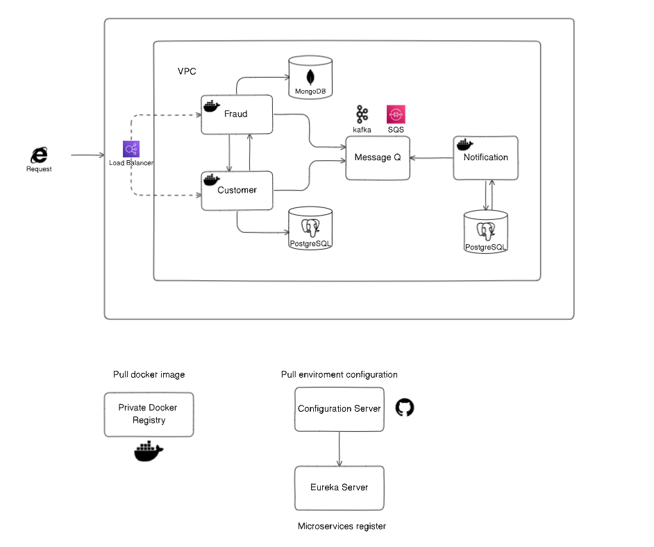

# simple-microservices

The diagram shows the architecture of this simple microservices.

For load balancing, you can use ELB, Azure Load Balancer, or any other provider you prefer. Similarly, you can use SQS or RabbitMQ for message q.

Docker allows each microservice to be containerized, which means it can run in a standalone, isolated environment with all its dependencies bundled together. Containers ensure that the microservice operates consistently across different development, testing, and production environments.

